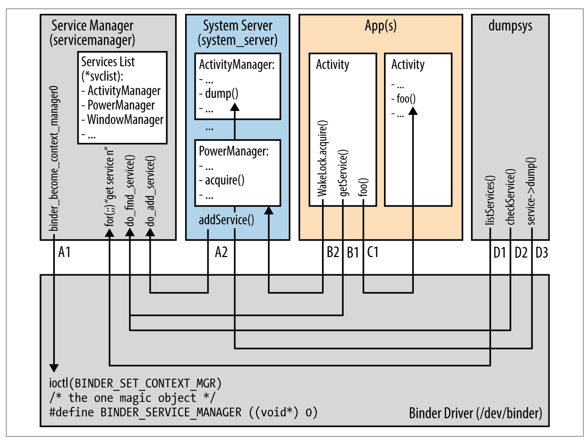
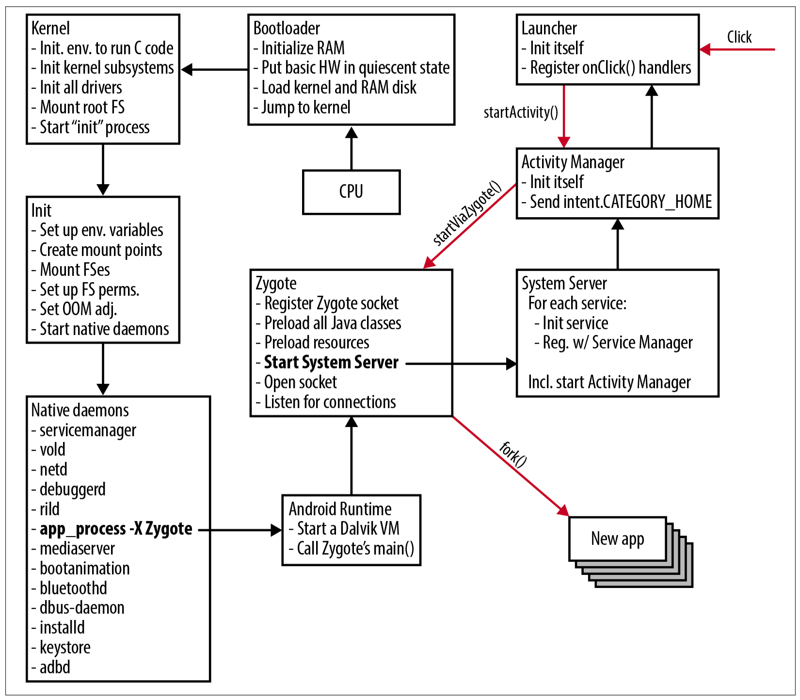

&nbsp;

Notes are based on Karim Yaghmour's *Embedded Android*.

\newpage

# Introduction

The **Android Platform**, also known as **AOSP**, is a custom Linux distribution containing user-space packages that make up what we normally call "Android". There are 2 parts to Android

- Android compatible kernel (Subjected to licensing)

- AOSP release

# Internals Primer

## App Developer View

Applications consists of **components** that can communicate with components from other applications

### Components

Applications don't have a single single entry point (e.g. no `main()`)

Instead, predefined events called **intents** are used to tie components, enabling components to be activated on event. Thus an app has as many entry points as it has components

Types of components:

1. **Activities**: Visual building blocks of Android apps

    - One global intent allows app icons to be displayed on the app launcher. Thus the app will define at least one activity to respond to this intent

    - Typically the user will move through several activities, creating a **task**, a stack of activities that are related to each other

      - The user can switch tasks by hitting the home button and choosing another activity stack

2. **Services**: Background processes exposed to applications

    - Activated when another component requires its services

    - Made available to components outside the app

3. **Broadcast Receivers**: Handle events on behalf of applications

    - When a key event occurs, the appropriate broadcast receiver triggers to handle the event

4. **Content Providers**: Databases for Android devices

    - Apps usually have content providers when they need to make data accessible to other apps

### Intents

**Intents**: Allow components to interact with each other. Akin to Unix signals. Intents can be handled 2 ways:

- **Implicit**: Components declare an intent filter in the Manifest file for that particular intent

- **Explicit**: The intent is sent to a specific component bypassing the need to declare the intent in the receiving component intent filter

### RPCs

**Remote Procedure Calls (RPC)**: Mechanism for communicating between two processes that live in different memory addresses

Android defines its own RPC/IPC mechanism called **Binder**:

- Communication between components is not usually done through sockets. Instead, components use the in-kernel *Binder* mechanisms

- App developers don't interact with *Binder* mechanisms directly. Instead they use **Android Interface Definition Language (AIDL)** to generate proper stubs and marshaling/unmarshaling code required to transfer objects using *Binder* mechanisms

### Frameworks

**Frameworks** give developers access to functionality found in other developer frameworks. Some examples include

- **User Interface**: All UI objects are descendants of the `View` class and organized within a hierarchy of `ViewGroups`

  - Activity UI is displayed when its content is set as the root of a `ViewGroup` hiearchy

- **Data Storage**:

  - **Shared Preferences**: For simple needs, Android stores key-value pairs in a data set shared by allcomponents of an app

  - We can also store data in a private file

  - We can also use SQLite to manage a private database

- **Security and Permissions**: Security is enforced at the process level

  - Every app gets is own UID and GID (group ID) and each app is treated as a separate user. Thus an app cannot access another app's resources without permissions

  - To access system services, an app m ust declare what permissions it needs in the `manifest` file

## Linux vs. Android Kernel

The Android kernel has several *Androidisms*, which are changes to the original Linux kernel it was forked from

### Wakelock

For a typical computer, the user has to tell the computer to go to sleep, which helps conserve energy and battery life

Android devices on the other hand want to sleep as soon and as often as possible

To keep devices awake during important processes, **wakelocks** are provided to keep the system awake

Apps can grab wakelocks while doing critical operations or waiting on user input

### Low Memory Killer

The **Low Memory Killer** helps weed out processes hosting components that haven't been used in a long time and aren't a high priority

This helps prevent the system from running **Out of Memory (OOM)**

### Binder

**Binder** is a RPC/IPC mechanism that provides remote object invocation capabilities on top of the operating system

This allows apps to talk with the System Server and allows apps to talk to each others' service component

App developers don't directly access the Binder, instead they use interfaces and stubs to communicate

### Anonymous Shared Memory (ashMen)

**Ashmen** is an IPC mechanism that is done through shared memory

First, a process creates a shared memory region using Ashmen and then uses Binder to share the corresponding file descriptors with other processes that the original processes wishes to share the region with

### Alarm

The default kernel **Alarm** functionality wasn't sufficient for Android requirements

- Typical functionality was unable to keep the timer running when the device is suspended

- Android alarm gets around this issue

### Logger

Android defines its own logging mechanisms

Typical Linux logging requires sending messages through sockets and storing the information in files

Android instead manages kernel-hosted buffers for logging data

- Avoid superfluous writes

- Lightweight and efficient so it can be used by user-space components

- `Log` and `EventLog` are exposed to app developers whereas `Slog` is reserved only for AOSP use

- Logs can be dumped into the console using `logcat`

- **Android Debug Bridge (adb)**: daemon that runs in Android devices. We can use `adb logcat` to dump main buffer logs to the console

## Android User Space

### File System

`/system`: Main Android directory for storing immutable components from the build

`/data`: Stores app data

### Libraries

These are stored in `/system/lib`

- Some of are from exteneral libraries

- Some are libraries from AOSP

### Init

After the kernel finishes booting, it starts a user-space process called `init`, which is responsible for spawning other processes and services

In particular, `init` starts a few key **daemons** that continue for the entire system lifetime

The init configuration is stored in `/init.rc` or `/init.<device-name>.rc`

**Note**: `adb shell getprop` will show a list of properties and values

### Command-Line Utilities

`/system/bin/`, `/system/xbin/`, and `/system/sbin/` contain the majority of command line utilities available to Android (A subset of the typical utilities available for Linux

## System Services

All system service calls go through Binder

**Note**: `adb shell service list` will list all available services

### Service Manager and Binder Interaction

For a process to invoke a system service through Binder, it must first have a handle to it. Under the hood, system service handler lookup is done through the **Service Manager**, which is started by `init`

- Every service is registered with the Service Manager

- When an app calls a system service, the Service Manager provides a handle to the service

- For service components, calls go directly through Binder, rather than through the Service Manager

As an example, grabbing a wakelock within an app will look like

{ height=400px}

```
PowerManager pm = (PowerManager) getSystemService(POWER_SERVICE);
PowerManager.WakeLock wakeLock = pm.newWakeLock(PowerManager.FULL_WAKE_LOCK, "myWakeLock");
wakeLock.acquire(100);
```

Notice that we don't see Service Manager. Insetad, we use `getSystemService()`, which will use Service Manager to locate the Power Manager service

**Note**: `adb shell dumpsys` dumps the status of all system services

\newpage

## System Startup

{ height=400px}

CPU starts up $\rightarrow$ bootloader initializes RAM, loads the kernel, sets the hardware in an inactive state, and jumps to kernel mode

Then kernel startup then begins, initializing subsystems and calling `init`, which sets up the Android environment, mounts any necessary hardware, and starts native daemons

After the native daemons load, Android Runtime starts which starts the Dalvik virtual machine and initializes **Zygote**

**Zygote**: special daemon that launches apps, centralizing components shared by all apps and shortening startup time

- Is only active when a new app needs to be launched

- Preloads all Java classes and resources that an app might need at runtime into the system's RAM

- Listens for connections on its socket for requests to start new apps. Each launch of a new app forks the Zygote process. Thus Zygote is the parent of all applications in the system

- Also explicitly starts the System Server, which initializes each system service and registers it with the System Manager

The System Server will start the Activity Manager which listens for app launches (triggered by the user clicking on an app)

- **Note**: Activity Manager will send `Intent.CATEGORY_HOME` once it complete initializations, which starts the Launcher app which displays the home screen
