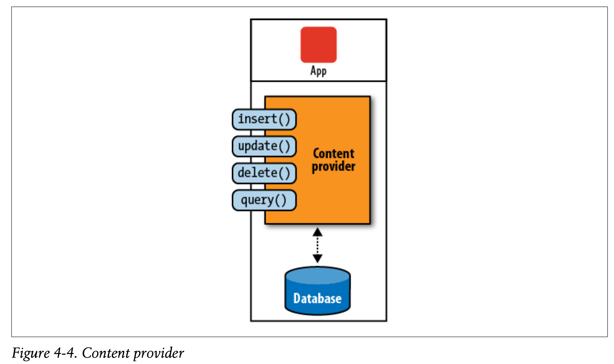

&nbsp;

Notes are based on Marko Gargenta's *Learning Android*

\newpage

# Android Overview

Android is a **comprehensive**, **open source platform** designed for mobile devices and is owned by the Open Handset Alliance

- Goal of the alliance is to offer consumers less expensive and better mobile experience

- **Comprehensive** means that it is a complete software stack for mobile devices

  - For developers, Android provides all the tools and frameworks for mobile app development

  - For users, Android works out of the box, and also allows users to customize their phone experience

  - For manufacturers, Android is a solution for running their devices by providing the software to run on hardware

- Because Android is **open source**

  - Developers have access to the entire platform source code, allowing them to see the guts of how the Android operating system works

  - Manufacturers can easily port the Android operating system to their specific hardware

- Because Android is designed for mobile devices, constraints such as battery-life and limits in memory and speed were considered and addressed throughout the platform, resutling in an overall better user experience

## Android Compatibility

Google created **Compatibility Test Suite (CTS)**, which defines what is means to an Android-compatible device. It consists of

- Automated tests

- Documents specifying what Android devices must have and should be able to do

CTS ensures that for consumers, the typical app from the market will run on any average Android device supporting a certain version of Android, preventing fragmentation of the Android operating system

However, it is up to the creator of a custom Android version to self-test its compatibility with CTS; Android doesn't enforce CTS compatibility unless the device wants to use proprietary Android apps such as Google Play Store

## Android Flavors

The base vanilla flavor of Android is known as **Android Open Source Project (AOSP)**. However, most manufacturers add on top of AOSP to build their own flavor of Android. These changes are known as **add-ons** (e.g. overlays, skins, or mods)

\newpage

# The Stack

{ height=500px}

## Linux Kernel

Android is built on top of a Linux Kernel. This provides a variety of benefits, including

* **Portability**: The Linux code can easily compile is a variety of hardware architectures, giving Android a level of hardware abstraction

* **Security**: Linux has been throughly tested over the yaers, making it very secure. All Android applications run as a separate Linux process with permissions set by the Linux system

* **Features**: Linux provides several features that Android uses, including memory management, power management, and networking

## Native Layer

This layer exists in the user space, contains code mostly written in C/C++, and consists offer

- **Hardware Abstraction Layer (HAL)**: Abstracts the complexities of using device drivers by defining a shared native library for each major device driver that manufacturers can use, essentially creating a unified device driver model

- **Native Libraries**: Native C/C++ libraries that support the Android Application Framework layer. These include

  - Binder: Fast IPC mechanism that allows Android apps to talk to each other

  - Framework Libraries: Libraries that support support system services, such as location, media

  - Webkit: Fast web-rendering engine for browsers

  - SQLite: SQL database

  - Apache Harmony: open source implementation of Java

  - OpenGL: 3D graphics libraries

  - OpenSSL: Secure socket layer

- **Native Daemons**: Code that supports system services and is started by the `init` process. These include:

  - Service Manager (`servicemanager`): process running all other framework services

  - Installation Daemon (`installd`): Manages apps, including downloading, updating, and granting permissions to them

  - Media Server (`mediaserver`): Supports all media services such as camera

  - Android Debug Bridge (`adbd`): Allows developers to connect to the device from their computer

- **Native Tools**: Includes several Linux CLI tools, as well as the `init` process that starts all native daemons.

  - In particular, Android has a CLI shell that developers can access through `adb`, although it only contains a subset of the normal Linux CLI commands

### Dalvik

Instead of the typical JVM, Android uses Dalvik VM, a virtual machine designed to optimize Android with features specific to mobile devices (e.g. battery life and processing power)

With Dalvik, the code compilation pipeline is different from the typical Java pipeline

Java source code --> Java byte code --> Dalvik byte code --> Dalvik executable

{ height=300px}

## Application Framework

Application frameworks provide an environment of services for developers to use when making applications. These **services**, or **managers**, provide services applications can use such as

- Location

- Sensors

- WiFi

## Applications

An Android application is a single **Application Package File (APK)**, which has 3 main components:

- Android Manifest File: File that lists all of the app's components, permissions, version, and minimum API level needed to run it

- Dalvik Executable: Java source code compiled down to a Dalvik executable that runs the application

- Resources: Everything the application needs that isn't code like images, videos, XML layouts

- Native Libraries: The application may use native C/C++ libraries that are packaged with the APK file

- Signatures: Certifies the author of the application and is located in the `META-INF` folder

&nbsp;

Any Android application must be signed before it can be installed on a device. Apps can be installed in various ways

- Google Play Store: Typical way of installing apps and allows Android to enforce CTS requirements on devices

- Other Markets: Other companies have their own app store (e.g. Amazon App Store). Devices installing apps from other markets don't always have to adhere to CTS

- Side-loading Apps: Apps can be installed over `adb`. Here the application APK file will be installed onto the device

# Android Project Structure

## Manifest File

File that explains what the application consists of, its main building blocks, and what permissions it requires

## Layout XML Code

This XML file specifies the layout of the screen

## Strings

This XML file contains all text the application uses (e.g. names of buttons and labels)

## The R File

The R file glues the Java code with the application resources

## Java Source Code

Source code that is converted to Dalvik executable that runs the application

# Main Building Blocks

An Android application can be considered a loose collection of activities, services, providers, and receivers

## Activity

Actitives are usually a single screen the user sees on the device. Applications usually consist of multiple activities (representing different "pages" on the application)

* The "home page" of an Android application is the "main" activity

Activity creation involves

* Starting a new Linux process

* Allocating memory for all UI objects

* Inflating objects from XML layouts

### Activity Life Cycle

The Activity Manager is responsible for creating, destroying, and managing activities

Application developers don't have control over what state an activity is in. Instead they have control over what happens during the transition between states

{ height=300px}

**Starting State**: When an activity doesn't exist in memory, it is in a **starting state**. During start up, the activity goes through several callback functions and eventually reaches a **running state**

* The transition between starting state and running state is extremely expensive

&nbsp;

**Running State**: The activity that is currently on the screen and interacting with the user. We say that this activity is in **focus** and is given priority for memory and resources for user ease of use

* There can only be one running activity at a time

&nbsp;

**Paused State**: When an activity is not in focused but still visible, it's in a **paused state**. Since the paused activity is still visible, they still have a high priority for memory and resources

* An example of a paused state would be a popup dialog box

* All activities go through a paused state before being stopped

&nbsp;

**Stopped State**: When the activity is not visible but still in memory, it's in a **stopped state**. Systems keep activities in a stopped state since the user might want to come back to it and restarting a stopped activity is much cheaper than starting it from scratch since all resources are already in memory

&nbsp;

**Destroyed State**: When the activity is no longer in memory, it is in a **destroyed state**. The Activity Manager decided that the activity was no longer needed and could be destroyed

* An activity may perform operations (e.g. saving information) before it's destroyed but this cannot be guaranteed

* A paused activity could be destroyed as well so it's important to do important work when the activity is en route to a paused state rather than destroyed state

## Intents

Intents are asynchronous messages sent between Android building blocks. They can

* Trigger an activity to start

* Tell a service to start or stop

* Can also be broadcasts

Intents can are either

* **Explicit**: The sender specifies which component should receive the intent

* **Implicit**: The sender specifies a type of receiver (e.g. any browser to open a link)

## Services

{ height=200px}

Services perform actions in the background and don't have any UI components

Services also have a much simpler life cycle than activities (can only be `started` or `destroyed`) and developers have more control over its life cycle

Note that by default, service and activities both run on the same thread: the **Main UI Thread**, although sometimes the service might be run on another thread to not block the activity (e.g. connecting to a server)

\newpage

## Content Providers

{ height=300px}

Content Providers are interfaces for sharing data between applications

By default, Android runs each application is its own memory section, so all data from the application is isolated from other applications in the system. Although small amounts of data can be sent via intents, content providers are much better for sharing persistent data between large datasets and adheres to the CRUD principle.

This separates the complexity of managing data (e.g. contact information) and displaying data (e.g. listing contacts), allowing developers to create their own version of an app using the same data

## Broadcast Receivers

Broadcast receivers are Android's implementation of system-wide publish/subscribe mechanism (**Observer Pattern**)

* The receiver is dormant code that is activated once an event its subscribed to occurs

## Application Context

Application context refers to the application environment and all the processes the components are running on. This environment allows applications to share data and resources

* Application context is uniquely identified by the application package name

* Application context is created when the first component (activity, service, or receiver) of an application is started

* Application contexts live as long as the application is alive, and thus are independent of the activities life cycle

# Android User Interface

## Two Ways to Create a User Interface

**Declarative**: Use XML to declare what the app should look like. Isn't good with handling user input so you should only use declarative user interface when dealing with static content

**Programmatic**: Use Java to declare components of the app. However, this requires defining each property of the component in Java so programmatic user interface should only be used for handling dynamic content or handling user interaction

## Views and Layouts

Android organizes UI elements into layouts and views

* **Views (Widget)**: Everything the user sees such as buttons, labels, text boxes

* **Layouts**: Organizes views, grouping together elements and allocating space for each child. Thus layouts can contain other children, which can be layouts themselves.

{ height=300px}

### LinearLayout

LinearLayout simply lays out its children next to each other (either horizontally or vertically), asking each child how much space it needs and allocates that space to each child in the order they are added

* If an older child asks for the entire screen space, there won't be much left for the subsequent widgets in this layout

* Defining the `layout_orientation` property to `vertical` or `horizontal` sets the direction in which the children are populated

### TableLayout

TableLayout lays out its children in a table, which consists of TableRow widgets

* Each TableRow can take multiple child components and will organize them in a linear fashion

* Defining the `stretch_columns` property indicates which columns of the table to stretch. Using `*` will stretch all columns

### FrameLayout

FrameLayout places children on top of each other. This is useful for tabs or when we need a placeholder for other widgets that will be populated later on

### RelativeLayout

RelativeLayout lays out its children relative to each other, requiring each child view to have an ID so it can position itself relative to other children

- If you end up nesting 2 horizontal LinearLayouts within 1 vertical LineraLayout, this can instead be achieved by using a single RelativeLayout

### AbsoluteLayout

AbsoluteLayout posititions its children at absolute coordinates on the screen

## Threading in Android

A thread is a sequence of instructions executed in order.

### Single Thread

By default, an Android application runs on a single thread (called the **UI Thread**), which is serial, or blocking, meaning that the next command is not completed until the preceding command is completed

### Multithreaded Execution

Instead of having operations block on an application, we have potentially long operations run on a separate thread. The system will slice the available CPU to prevent process starvation

Using Java's `Thread` class is problematic since a thread taht didn't create the UI widget cannot update the UI. Instead, Android provides the utility class `AsyncTask` for multithreading in Android applications

### AsyncTask

AsyncTask is a mechanism to help handle long operations that need to report to the UI thread, using methods to fill in what happens during various stages of the operation such as

* `doInBackground()`

* `onProgressUpdate()`

* `onPostExecute()`

# Filesystem

Android has 3 main filesystem partitions

## System Partition

Located in `/system/`, this partition contains the entire Android operating system: all preinstalled applications, system libraries, Android frameworks. This partition is also read-only

## SDCard Partition

Located in `/sdcard/`, this partiition is a mass storage area where apps can read and write files to

## User Data Partition

Located in `/data/`, this partition stores all user data, downloaded app locations, and application data

- `/data/app` contains user apps

- `/data/data` contains subfolders (identified by the Java package) corresponding to each app

# Broadcast Receivers

Broadcast Receivers are Android's implementation of the publish/subscribe messaging pattern

- Applications (known as publishers) generate broadcasts that sends events without knowing who, if anyone, will receive them

- Receivers (subscribers) that want that information/event subscribe to specific messages via **filters**. If the message matches the filter, the subscriber is notified of the message

Receivers use the `onReceive()` callback method when they are notified of an incoming intent

Intents can come from the system (e.g. `android.permission.RECEIVE_BOOT_COMPLETED`) or from an application using the `sendBroadcast()` method

# Android Interface Definition Language

For security reasons, Android applications can't directly access data from other applications. However, there are ways for applications to communicate with each other (e.g. Intents).

For synchronous access between processes, we use **Interprocess Communnication (IPC)**, which requires converting data from its in-memory format to a format convenient for sending to another process (**marshaling**) that is then unpacked at the receiver (**unmarshaling**)

Android provides the Android Interface Definition Language (AIDL)
